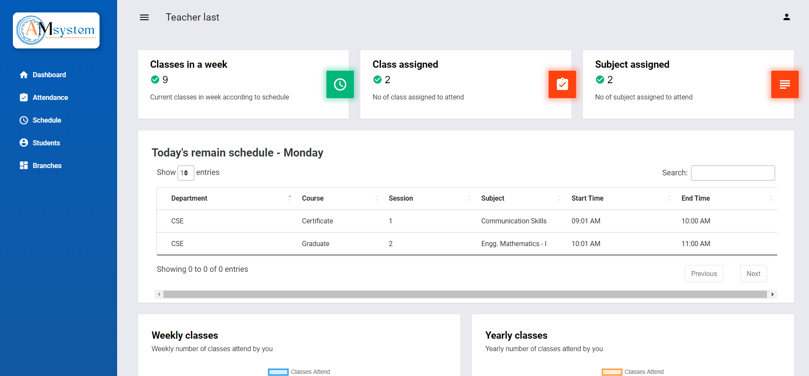
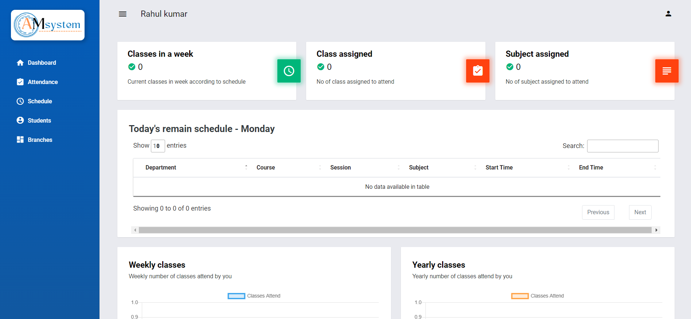

# Attendance application
Online student attendance and schedule management system. 
- Able to time and effort of teacher 
- Create attendance transparacy between student and teacher
- Every table data can be downloaded as excel and pdf. 
- File upload used for creating multiple tuples.

## Admin panel

### Features
* Check overview of teacher, student and attendance.
* Create department, course type and subject.
* Then you can make branch by combination of this 3.
* Create attendance type for attendance like Present, Absent, Leave and something else.
* Create teacher using form or file upload. Then you can create teacher schedule.
* Create teacher using form or file upload.
* Add student class/branch using form or file upload.
* Admin can also promote student branch session/semester
* Admin can check student profile (personal detail, change password, time table, deactivate or delete account) and analyse student attendance.
* Search department, student, teacher

## Teacher panel

### Features
* Check overview of classes and shedule.
* Teacher can take live attendance, see schedule, student details, and branches assign to teacher
* Live attendance means teacher can't take attandance any time.  

## Student panel

### Features
* Check overview of classes and shedule. 